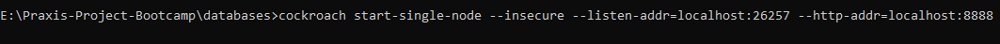
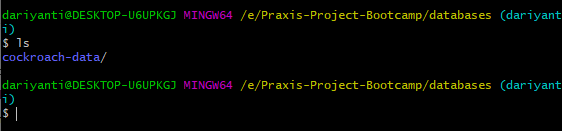

# COCKROACH GUIDE

Dokumentasi ini hanya menjelaskan tentang cockroach db

## KEBUTUHAN UTAMA

---

## WINDOWS

1. Download binary file nya dari [sini](https://binaries.cockroachdb.com/cockroach-v19.2.0.windows-6.2-amd64.zip), link tersebut akan mendownload cockroach db versi 19.2 pada saat dokumentasi ini ditulis
2. Setelah itu extract kemudian copy pastekan folder yang telah terextract ke `C:\Program Files\`
3. Setelahnya masukkan `FOLDER PATH` cockroach tersebut ke `PATH` nya windows, dengan cara mengedit di environtment variables yang ada di dalam settings windows
4. Selanjutnya ketikkan command `cockroach version` untuk melihat apakah cockroach sudah berada pada `PATH` yang benar.

## LINUX

Untuk linux sendiri dokumentasi nya sudah dituliskan secara jelas [disini](https://www.cockroachlabs.com/docs/stable/install-cockroachdb-linux.html), sehingga tidak perlu saya jelaskan lagi

---

## MEMBUAT DATABASE PERTAMA KALI

Kita akan membuat akses database yang `insecure` karena masih dalam tahap pengembangan

Karena masih tahap pengembangan, kita gunakan single node saja

1. Pada directory folder yang diinginkan, sebagai contoh kita buat folder `databases` diatas folder `documentation` ini
2. Kemudian ketikkan command pada `terminal` atau `cmd` `cockroach start-single-node --insecure --store=religionDb --listen-addr=localhost:26257 --http-addr=localhost:9090 --background`, pada windows kemungkinan flags `--background` akan menyebabkan error, cukup hapus flags tersebut dan biarkan `terminal` atau `cmd` tersebut, jangan di close, atau koneksi kalian ke database tersebut akan terputus

3. Akan terdapat folder `religionDb` disanalah database kalian

4. Selamat anda telah melakukan inisialisasi awal membuat database di cockroach

## MENGAKSES DATABASE YANG TELAH DIBUAT

Pada kasus tertentu jika kalian sudah melakukan pekerjaan tersebut, dan menshutdown laptop kalian / mengclose `cmd` kalian bagi yang diwindows, koneksi kalian ke database akan terputus, maka untuk melakukan inisialisasi awal lagi dengan langkah berikut :

1. Pada folder `databases` yang ada folder `religionDb`, tinggal jalankan command `cockroach start-single-node --insecure --store=religionDb --listen-addr=localhost:26257 --http-addr=localhost:9090 --background`, command tersebut akan menyalakan database kalian lagi
2. Untuk mengakses database tersebut bisa menggunakan command `cockroach sql --insecure --host=localhost:26257`

3. Screenshot diatas menandakan bahwa telah berhasil melakukan login ke cockroach db
4. Tinggal lakukan query `SQL` yang telah dipelajari sebelumnya, untuk membuat database dan table baru
5. Untuk keluar dari mode cockroach terminal tuliskan command `\q`

## MEMUTUSKAN KONEKSI DARI DATABASE

Untuk memutuskan koneksi ke database tinggal mengclose `cmd` kalau di windows, tapi langkah ini sangat tidak direkomendasikan, karena memungkinkan terjadinya kerusakan terhadap database. Untuk itu maupun di linux atau di windows gunakan command `cockroach quit --insecure --host=localhost:26257`
